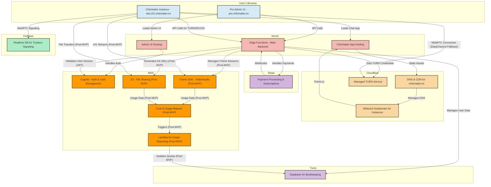
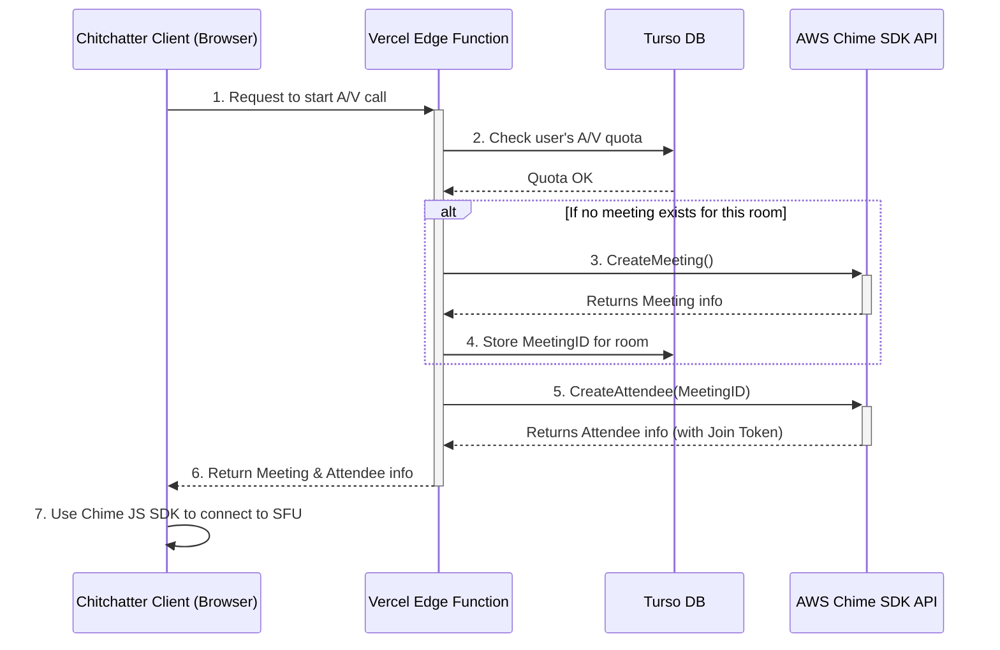
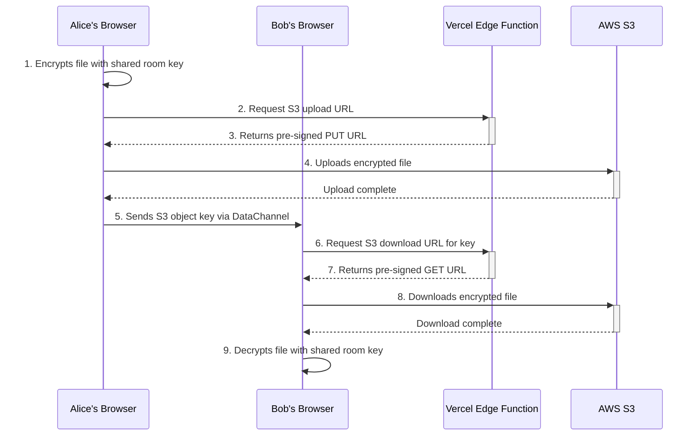

# Chitchatter Pro: System Architecture

This document outlines a cost-effective and scalable server-side architecture for Chitchatter Pro. The core principles are:

1. **Zero User-Content Storage**: The server will never see or store the content of user communications.
2. **Bootstrapped Economics**: Services are chosen to minimize upfront costs and scale predictably with revenue.
3. **Operational Simplicity**: Leverage managed services and serverless functions where possible.

## II. Development Phases

This document outlines the desired architecture for Chitchatter Pro. However, development will be executed in iterative phases.

### Phase 1: Minimum Viable Product (MVP)

The primary goal of the MVP is to deliver the core value proposition of a secure, private, and easy-to-use communication tool. The feature set will be limited to what is essential for this purpose.

- **Core Technology:** Peer-to-peer (P2P) connections for all communication, including data, audio, and video.
- **Fallback Mechanism:** A managed Cloudflare TURN service will be used as a relay to ensure connectivity when direct P2P connections fail.
- **Authentication:** AWS Cognito for user sign-up, login, and management.
- **Bookkeeping:** Turso database for managing user accounts and subscriptions.
- **Signaling:** Firebase Realtime Database for WebRTC signaling (via Trystero).
- **Hosting:** Vercel for the frontend application and backend logic.

### Phase 2: Post-MVP Enhancements

Following a successful MVP launch, subsequent phases will focus on enhancing the service with features that support larger groups and more advanced use cases. These features will be introduced as part of the pay-as-you-go offerings.

- **Scalable A/V for Larger Groups:** Integration with the **AWS Chime SDK** to provide a Selective Forwarding Unit (SFU). This will allow for high-quality audio and video calls with a larger number of participants than is feasible with P2P connections (up to 15 initially).
- **Managed File Sharing:** Integration with **AWS S3** for reliable, managed file transfers. This overcomes the limitations of P2P file sharing, such as the requirement for both users to be online simultaneously.

## III. High-Level Architecture Diagram

## IV. Service Breakdown & Rationale

### 1\. **Authentication & User Management: AWS Cognito**

- **Role**: User authentication and management.
- **Function**: AWS Cognito will manage the user directory (User Pools) and handle the entire user lifecycle: sign-up, sign-in, and session management via JWTs.
- **Integration**: The `pro.chitchatter.im` frontend will use the AWS Amplify client libraries to interact with Cognito. The Vercel Edge Functions will validate the Cognito-issued JWT on every protected API request.

### 2\. **Database for Bookkeeping: Turso**

- **Role**: User account, subscription data, and usage quotas.
- **Function**: Turso is our choice for user bookkeeping data due to its low-latency performance at the edge, which is a perfect match for Vercel's Edge Functions.
- **Integration**: Vercel Edge Functions will use the Turso SDK to manage this data.

### 3\. **P2P Signaling: Firebase Realtime Database**

- **Role**: Peer-to-peer connection signaling.
- **Function**: The Firebase Realtime Database is used solely for the Trystero signaling mechanism, as it is the most reliable method supported by the library.

### 4\. **Hosting & Backend Logic: Vercel**

- **Role**: Frontend hosting and backend API logic.
- **Hosting**: The `pro.chitchatter.im` Admin UI and the `*.chitchatter.im` Chat App are hosted on separate Vercel projects.
- **Backend Logic**: Vercel Edge Functions are the central hub, responsible for handling all API requests, validating user sessions with Cognito, and integrating with other services.

### 5\. **DataChannel Relay: Cloudflare TURN Service**

- **Role**: Provides a fallback connection for WebRTC DataChannels when a direct P2P connection fails.
- **Function**: Since all high-bandwidth traffic (video, audio, files) is handled by other services, the TURN server is only used for low-bandwidth, low-latency DataChannel setup and basic messaging. A managed service is ideal for this.
- **Rationale**: Using a managed service like Cloudflare's eliminates the need to set up, secure, and maintain our own server infrastructure. This drastically simplifies operations and reduces fixed costs, aligning perfectly with our core principles. The risk of runaway costs is negligible due to the low-bandwidth nature of the traffic and the use of short-lived credentials (e.g., 10-minute TTL).

### 6\. **Pay-as-you-go Features & Payments: AWS, Stripe**

- **Stripe**: Manages all payment processing and subscriptions.
- **AWS Chime SDK & S3 (Post-MVP)**: These services will manage real-time audio/video sessions and file transfers, respectively. They form the core of the pay-as-you-go offerings planned for after the initial MVP launch. The Chitchatter client will get temporary credentials from our backend to interact directly with these services.

## V. Integration Flow

1. A user signs up on `pro.chitchatter.im` using an authentication flow powered by **AWS Cognito**.
2. Upon successful sign-up and payment via **Stripe**, a webhook is sent to a dedicated **Vercel Edge Function**.
3. This function validates the webhook, generates a unique `instanceId`, and creates a new user record in the **Turso** database, initializing their usage quotas.
4. **MVP:** When a user's P2P connection needs a relay, the client calls a **Vercel Edge Function** to request credentials for the **Cloudflare TURN service**.
5. **Post-MVP:** When a user on a Pro instance needs to use a pay-as-you-go managed service (like the Chime SFU or S3 file sharing), the client will call a dedicated API endpoint on a **Vercel Edge Function** to request credentials.
6. The function validates the user's **Cognito** session and queries the **Turso** database to check their subscription status and current usage quota for the requested service.
7. **If the quota has not been exceeded**, the backend calls the appropriate service API (**Cloudflare TURN**, **AWS Chime**, or **AWS S3**) to generate and return temporary, short-lived credentials to the client. If the quota _has_ been exceeded, it returns an error, allowing the client to fall back to P2P-only mode or display a relevant message to the user.
   1. As a post-MVP enhancement, customers will have the option to set a customized budget for overage bandwidth.

## VI. Architectural Decision: Multi-Tenant vs. Single-Tenant

A key decision in this architecture is the use of a **multi-tenant** (shared infrastructure) model rather than a **single-tenant** (dedicated infrastructure per customer) model.

- **Multi-Tenant (Current Approach):** All customers share the same pool of backend resources (TURN service, databases, backend functions). This is analogous to an apartment building where tenants share the core plumbing and electrical systems.
- **Single-Tenant (Alternative Approach):** Each customer would get their own dedicated set of resources. This is like building a separate house for each tenant.

**Rationale for Choosing the Multi-Tenant Model:**

The multi-tenant approach was chosen for the primary "Core" offering for two critical reasons:

1. **Cost-Effectiveness:** The fixed costs of the infrastructure are extremely low, as we are leveraging managed services with generous free tiers. This allows us to offer the service at a low price point and remain profitable.
2. **Operational Simplicity:** Managing, patching, and monitoring a single, shared pool of resources is significantly simpler than managing a separate fleet of infrastructure for every individual customer. This simplicity is vital for focusing engineering efforts on the core product.

While a single-tenant model offers greater isolation, it is not sensible for our primary market. However, the concept is strategically valuable and can be reserved for a future, high-priced **"Enterprise" tier**, where the high price would justify the cost and complexity of providing dedicated, isolated infrastructure.

## VII. Post-MVP: AWS Chime SDK Integration Deep Dive

> **Note:** This feature is planned for a post-MVP release.

For Chitchatter Pro, audio and video streams for larger calls will be routed through an **SFU (Selective Forwarding Unit)** provided by the AWS Chime SDK, rather than relying on direct P2P connections. This provides a more robust and reliable experience for multi-party calls.

### The Role of an SFU

An SFU acts as a smart conference call host. Instead of each participant establishing a direct video connection with every other participant (which is resource-intensive), each participant sends their single video stream to the SFU. The SFU then forwards that stream to all other participants. This drastically reduces the upload bandwidth required by each user, enabling high-quality calls with many participants.

### Chime SDK Integration Flow

**Step-by-step Breakdown:**

1. **User Initiates Call:** A user in a Pro room clicks the "Start Video" button.
2. **API Request to Backend:** The client makes a request to a dedicated API endpoint (e.g., `POST /api/join-meeting`).
3. **Vercel Edge Function Logic:**
   - The function validates the user's Cognito session and checks their subscription status and A/V quota in Turso.
   - It queries Turso to see if there is already an _active_ Chime `MeetingID` for this room.
   - **If no meeting exists:** It uses the AWS SDK to call Chime's `CreateMeeting` function. AWS returns a `Meeting` object, and the backend saves the new `MeetingId` in Turso, associated with the current room.
   - **The function then calls Chime's `CreateAttendee` function**, passing in the `MeetingId`. AWS returns an `Attendee` object containing a secret `JoinToken`.
4. **Client Receives Credentials:** The Edge Function returns the `Meeting` and `Attendee` objects to the client.
5. **Client Connects to SFU:** The client passes the received `Meeting` and `Attendee` objects to the **Amazon Chime JS SDK**. The SDK handles all the complex WebRTC logic, connecting the user to the AWS SFU and providing simple event handlers to manage video streams in the UI.
6. **Subsequent Users:** When other users join the call, the backend finds the existing `MeetingId` in Turso and simply creates a new `Attendee` for that meeting, ensuring everyone connects to the same SFU session.

## VIII. Usage Tracking and Abuse Prevention

A critical component of this architecture is the ability to track usage for each customer to enforce plan limits and prevent resource abuse.

### 1\. Cloudflare TURN Service (DataChannel Relay) - MVP

- **Measurement Strategy:** Use a **proxy metric** of credential allocations.
- **Implementation:** Since direct bandwidth measurement isn't available on the managed service, we will track the _number_ of times we issue a TURN credential to a customer.
  - A `turn_allocations_used` field will be stored for each customer in the Turso database.
  - Each time the Vercel backend successfully calls the Cloudflare API to generate a TURN credential for a user, it will increment this counter in Turso.
  - Before issuing a new credential, the backend first checks if `turn_allocations_used` is below the plan limit (e.g., 500 allocations/month).
- **Why this works:** The combination of very low-bandwidth traffic (DataChannel only) and short-lived credentials (10-minute TTL) makes this a safe and effective way to prevent a single user from constantly consuming relay resources.

### 2\. AWS Chime SDK (SFU for A/V) - Post-MVP

- **Measurement Strategy:** Use **cost allocation tagging** and periodic reporting.
- **Implementation:** This provides much more precise usage data.
  1. **Tagging:** When the Vercel backend calls the `CreateMeeting` function in the Chime SDK, it will add a unique tag to the meeting, such as `chitchatter-customer-id:<user_id_from_cognito>`.
  2. **Reporting:** In AWS, we will enable **Cost and Usage Reports (CUR)**. These reports are delivered to an S3 bucket and contain detailed line items of all AWS usage, including the tags we applied.
  3. **Processing:** An **AWS Lambda function** will be configured to trigger periodically (e.g., once every hour). This Lambda function will:
     - Read the latest CUR data from the S3 bucket.
     - Parse the data, looking for Chime usage line items.
     - Aggregate the total participant-minutes for each `chitchatter-customer-id` tag.
     - Update a `chime_minutes_used` field for each corresponding user in our Turso database.
- **Enforcement:** With a near-real-time view of each customer's Chime usage in Turso, the backend can accurately check against their "pay-as-you-go" limits before creating a new meeting or allowing a new attendee to join. This provides a robust and scalable system for managing our largest variable cost.

### 3\. AWS S3 (File Sharing) - Post-MVP

- **Measurement Strategy:** Use **cost allocation tagging** and periodic reporting, identical to the Chime strategy.
- **Implementation:**
  1. **Tagging:** When the Vercel backend generates a pre-signed URL for an S3 upload, it will ensure the subsequent `PUT` operation is tagged with the customer's ID (e.g., `chitchatter-customer-id:<user_id>`).
  2. **Reporting & Processing:** The same Lambda function that processes Chime usage will also look for S3 data storage and transfer line items, aggregating them by the customer ID tag.
  3. **Enforcement:** It will update a `storage_gb_used` field in Turso, allowing the backend to deny requests for new upload URLs if the customer has exceeded their storage quota.

## IX. Post-MVP: Managed File Sharing via AWS S3

> **Note:** This feature is planned for a post-MVP release.

The Pro plan will enhance file sharing by using AWS S3 as a temporary, reliable storage backend, while maintaining the core principles of end-to-end encryption and ephemerality.

### File Sharing Flow

**Step-by-step Breakdown:**

1. **Client-Side Encryption:** The sender's browser encrypts the selected file using a symmetric key that has been securely shared among the room's participants (e.g., via the Trystero DataChannel). The server _never_ sees the unencrypted file.
2. **Request Upload URL:** The client makes an API call to the Vercel backend to request a secure location to upload the file.
3. **Backend Logic (Upload):** The backend validates the user's session and quota. If clear, it generates a **pre-signed S3 `PUT` URL** for a unique, randomly generated object key. This URL grants temporary, write-only permission for that specific key.
4. **Direct Upload:** The client uploads the encrypted file directly to S3 using the provided pre-signed URL.
5. **Share Key:** The sender transmits the S3 object key (not the whole URL) to the other participants through the existing E2EE DataChannel.
6. **Request Download URL:** A receiving participant's client takes the object key and makes an API call to the backend to request download access.
7. **Backend Logic (Download):** The backend generates a **pre-signed S3 `GET` URL** for the requested object key, granting temporary, read-only permission.
8. **Direct Download:** The client uses the pre-signed URL to download the encrypted file directly from S3.
9. **Client-Side Decryption:** The receiver decrypts the file using the same shared room key.

### Automatic Ephemeral Deletion

To ensure files do not persist indefinitely, we will use **S3 Lifecycle Policies**.

- **Configuration:** The S3 bucket will have a lifecycle rule configured to **permanently delete any object 24 hours after its creation**.
- **Rationale:** This is the simplest and most robust method for ensuring ephemerality. It requires no complex presence-tracking or custom cleanup logic. A 24-hour TTL is short enough to align with the product's privacy promise while being long enough to allow for time zone differences among participants. This aligns perfectly with the "Operational Simplicity" principle.
